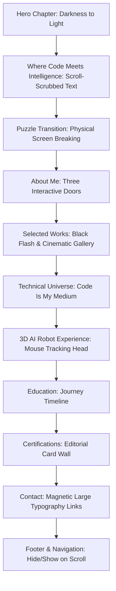

# Implementation Plan — Cinematic AI & Data Science Portfolio

Create a premium, cinematic, scroll-driven personal portfolio website for **Nandhakumar N**, a B.Tech Artificial Intelligence & Data Science student. It will feel like an interactive digital experience rather than a template, utilizing high contrast, luxury minimal layouts, deep red glows, glassmorphism, 3D interactions, and scroll-scrubbed storytelling.

## User Review Required

> [!IMPORTANT]
> The website is designed to be highly interactive, scroll-driven, and graphics-intensive, utilizing HTML5 Canvas, CSS 3D transforms, and custom scroll triggers.
>
> - **Performance & Motion**: Heavy scroll scrubbing and 3D mouse tracking can affect low-end devices. We will implement strict performance limits, checking for `prefers-reduced-motion` and mobile touch capabilities to disable resource-heavy animations (like the custom cursor, complex particle rendering, and 3D head movement) on devices where it would degrade the experience.
> - **Frameworks & Build Steps**: As per request, this is built purely with native vanilla HTML, CSS, and JavaScript. No external libraries like Framer Motion, GSAP, or Three.js will be used. Everything (smooth scroll, page transitions, 3D, and scroll animations) is hand-written.
> - **Assets**: The profile picture `assets/profile/profile.jpg` has been copied from the parent directory's public assets. Project cover images and textures will be programmatically generated or created using elegant visual SVG patterns or custom design structures to ensure they look premium right out of the box without requiring external file dependencies.

---

## Open Questions

> [!NOTE]
> There are no major blockers, but we want to confirm if you have certificate images or if you want us to style the certificate cards as authentic digital documents (using HTML/CSS vector layouts) that look like high-end certificates. We will default to a premium digital certificate wall with washi tapes and hover scales as specified in your design guidelines.

---

## Proposed Changes

We will create a clean and organized vanilla web project in the `poarfilo 11` workspace.

### Core Assets

#### [NEW] [content.js](file:///c:/Users/NANDHAKUMAR%20N/OneDrive/Documents/portfilo%202/poarfilo%2011/content.js)
Contains all data for projects, skills, certifications, education timeline, and contact information. This allows the user to easily update their details without editing layout or animation scripts.

#### [NEW] [index.html](file:///c:/Users/NANDHAKUMAR%20N/OneDrive/Documents/portfilo%202/poarfilo%2011/index.html)
The central document structure, hosting the semantic components for all 11 chapters. It includes Google Fonts (Anton, Archivo, Inter), handles responsive containers, and provides a fallback structure in case JavaScript is disabled.

#### [NEW] [styles.css](file:///c:/Users/NANDHAKUMAR%20N/OneDrive/Documents/portfilo%202/poarfilo%2011/styles.css)
The design system stylesheet. Defines custom CSS custom properties (variables), core styles, scroll container configurations, custom cursor layouts, cinematic grid dividers, noise textures, glassmorphism templates, and keyframe animations.

#### [NEW] [script.js](file:///c:/Users/NANDHAKUMAR%20N/OneDrive/Documents/portfilo%202/poarfilo%2011/script.js)
The interactive engine of the site. It coordinates:
- Smooth scroll orchestration (custom lightweight inertial scroll solver).
- Scroll-scrubbed typography revealing (pinned section 02).
- The CSS clip-path physical Puzzle Transition (section 03).
- About Me interactive cards / doors (section 04).
- Black flash and hidden portfolio gallery reveal (section 05).
- Intersection Observer-driven staggering and scroll elements.
- Interactive 3D Robot Head (section 07) that follows cursor coordinates.
- Staggered timeline and certificate layout animations.
- Custom cursor tracking, magnetic links, and mobile menu toggling.

---

## Storytelling & Chapters Design

### Chapter-by-Chapter Technical Design

1. **01 — HERO**: The viewport starts dark. Through staggered delays, a crimson glow (`radial-gradient`) appears behind the text. The name "NANDHAKUMAR N" fades in letter-by-letter with slight letter-spacing expansions. A custom SVG mask with technical crosshairs reveals the profile photo using a moving light overlay. A lightweight canvas particle engine draws fine dust floating in the background.
2. **02 — WHERE CODE MEETS INTELLIGENCE**: Pinned typography using `position: sticky`. The JS scroll listener tracks the scroll offset of this container. As scroll progresses (0% to 100%), CSS `clip-path` masks open up to reveal "CODE", "DATA", "INTELLIGENCE", "CREATIVITY" word by word. Each letter has custom CSS translations to disperse them slightly on scroll.
3. **03 — PUZZLE TRANSITION**: The previous section's layout is duplicated into a hidden grid of 12 distinct polygon pieces using `clip-path: polygon(...)`. When the scroll position transitions, the normal section is hidden, and these 12 pieces fly outwards, rotate, scale, blur, and fade out, revealing the About Me section below.
4. **04 — ABOUT ME**: 3 columns formatted as 3D perspective cards. Hovering/clicking them initiates a 3D rotate transition (`transform: rotateY(-90deg)`) simulating doors opening, revealing their rich inner content (who I am, what I do, how I think) with red technical HUD lines.
5. **05 — SELECTED WORKS**: A dark overlay hides the portfolio. A glowing button "ENTER MY WORK" triggers a rapid fullscreen flash (black -> crimson -> white -> black) to simulate a cinematic camera shutter, revealing the project grid. Project details open in a premium full-page side overlay with metrics and horizontal sliders.
6. **06 — MY TECHNICAL UNIVERSE**: Horizontal-ish grid. Title "CODE IS MY MEDIUM" enters from the left, while skills categories slide in from the right with staggered delays.
7. **07 — 3D AI ROBOT EXPERIENCE**: A vector-styled head built out of nested CSS 3D layers (faceplate, glowing visor, antenna, side sensors). Mouse movement relative to the screen calculates pitch and yaw angles, updating CSS variables `--rx` and `--ry` on the robot container. Surrounding glass panels hover dynamically in 3D space with float animations.
8. **08 — EDUCATION**: A vertical/horizontal timeline where scroll triggers a growing crimson line, and each milestone details fade in as the line crosses their threshold.
9. **09 — CERTIFICATIONS**: The cards are displayed on a slightly tilted grid (editorial paper layout), with washi tape visuals and stagger entrance animations.
10. **10 — CONTACT**: Large links with dynamic `::after` underline animations, magnetic offset physics, and hover glows.

---

## Verification Plan

### Automated Tests
- Run structural and script validation.
- Test loading with JavaScript disabled (ensure layouts, navigation, and content remain accessible).
- Test on different viewport configurations (Desktop 1440px+, Laptop 1280px, Tablet 768px, Mobile 375px) using DevTools.

### Manual Verification
- Test scroll-scrubbed progress by scrolling slowly, scrolling fast, stopping, and scrolling backwards to verify animations reverse perfectly.
- Hover over cards and links to verify custom cursor scaling and magnetic forces.
- Hover over the 3D Robot section to verify head-tracking responsiveness.
- Trigger the "ENTER MY WORK" transition to verify the screen flash effect.
